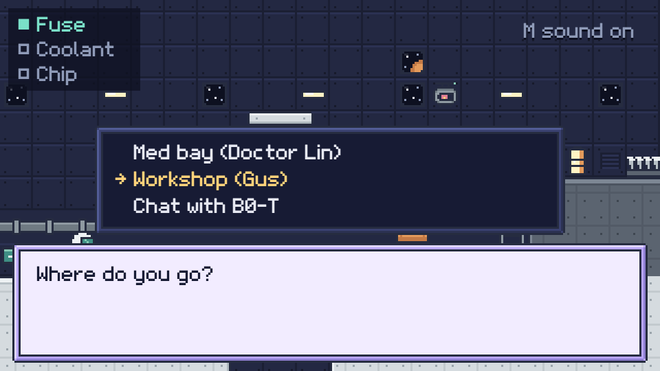

# Cozy Space Story Kit

A tiny **visual novel engine** for the browser, in plain HTML and JavaScript (no engine, no build step).
Write your dialog in `story.js`, upload the folder, done.

**▶ Play the sample story:** [aquumgifts.github.io/cozy-space-story-kit](https://aquumgifts.github.io/cozy-space-story-kit/) · also on [itch.io](https://aquumgifts.itch.io/cozy-space-story-kit)



## What's inside

- `index.html`: dialog box with a typing effect and talking portraits, choices, flags, backgrounds, title and end screens, music and sounds, keyboard / mouse / touch, sharp pixel scaling
- `story.js`: the sample story (a short shift on a space station) and the settings: title screen, characters, backgrounds, end screen
- `assets/`: art, font, music and sounds from the free Cozy Space set: 9 characters × 5 moods + talking, dialog boxes, space backgrounds, station rooms, 39 props, a pixel font, 3 music loops and 18 sound effects

## Write your story

Each line of dialog is a node in `story.js`:

```js
hello: { bg: "lab", who: "rosa", mood: "happy", text: "Hi!", next: "ask" },
ask:   { bg: "lab", text: "What do you say?", choices: [
         { text: "\"Hello, Rosa.\"", next: "nice", do: (s) => { s.friend = true; } },
         { text: "Say nothing.", next: "quiet" },
       ] },
```

- The story starts at `start` and ends with `next: "end"`.
- `who` / `mood` choose the portrait (neutral, happy, sad, angry, surprised); a neutral portrait talks while the text types.
- Choices can be hidden with `if: (s) => ...` and change flags with `do`. `text`, `mood` and `next` can be functions of your flags, for endings.

Run it locally with any static server (`python3 -m http.server 8000`) so music and sounds load.

## Licenses

- **Code** (`index.html`, `story.js`): MIT, see [LICENSE](LICENSE).
- **Assets**: the [Cozy Space set](https://itch.io/c/8266575) by Bramble & Byte, free to use in your games (commercial too); don't resell the assets themselves. Credit appreciated: "Cozy Space set by Bramble & Byte".

More sizes and formats of every pack, and the complete bundle: [aquumgifts.itch.io](https://aquumgifts.itch.io).
